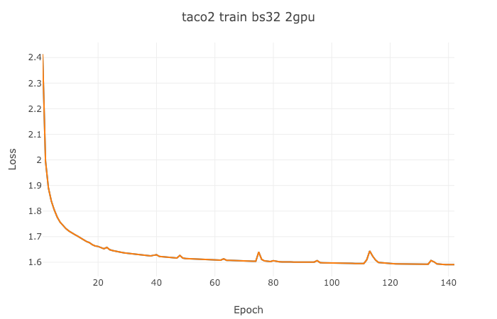
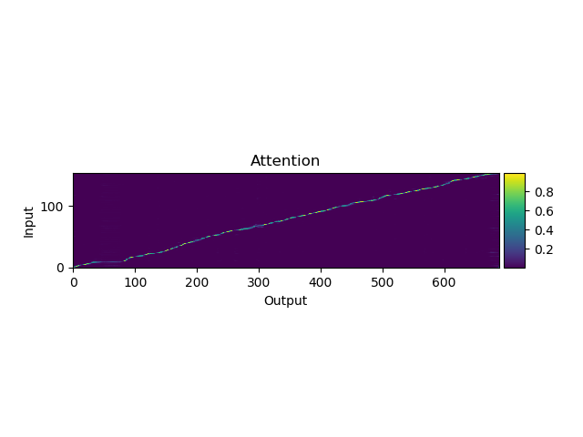
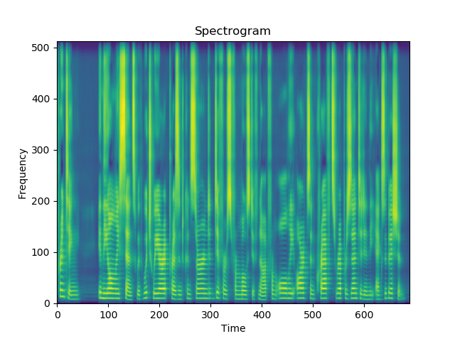

# Tacotron 2
A PyTorch implementation of Tacotron2, described in [Natural TTS Synthesis By Conditioning Wavenet On Mel Spectrogram Predictions](https://arxiv.org/pdf/1712.05884.pdf), an end-to-end text-to-speech(TTS) neural network architecture, which directly converts character text sequence to speech.


## Install
- Python3.6+ (Recommend Anaconda)
- PyTorch 0.4.1+
- `pip install -r requirements.txt`
- If you want to run `egs/ljspeech/run.sh`, download [LJ Speech Dataset](https://keithito.com/LJ-Speech-Dataset/) for free.


## Usage
### Quick start
```bash
$ cd egs/ljspeech
# Modify wav_dir to your LJ Speech dir
$ bash run.sh
```
That's all.

You can change parameter by `$ bash run.sh --parameter_name parameter_value`, egs, `$ bash run.sh --stage 2`. See parameter name in `egs/ljspeech/run.sh` before `. utils/parse_options.sh`.

### Workflow
Workflow of `egs/ljspeech/run.sh`:
- Stage 1: Training
- Stage 2: Synthesising

### More detail
`egs/ljspeech/run.sh` provide example usage.
```bash
# Set PATH and PYTHONPATH
$ cd egs/ljspeech/; . ./path.sh
# Train:
$ train.py -h
# Synthesis audio:
$ synthesis.py -h
```
#### How to visualize loss?
If you want to visualize your loss, you can use [visdom](https://github.com/facebookresearch/visdom) to do that:
1. Open a new terminal in your remote server (recommend tmux) and run `$ visdom`
2. Open a new terminal and run `$ bash run.sh --visdom 1 --visdom_id "<any-string>"` or `$ train.py ... --visdom 1 --vidsdom_id "<any-string>"`
3. Open your browser and type `<your-remote-server-ip>:8097`, egs, `127.0.0.1:8097`
4. In visdom website, chose `<any-string>` in `Environment` to see your loss

#### How to resume training?
```bash
$ bash run.sh --continue_from <model-path>
```
#### How to use multi-GPU?
Use comma separated gpu-id sequence, such as:
```bash
$ bash run.sh --id "0,1"
```
#### How to solve out of memory?
- When happened in training, try to reduce `batch_size` or use more GPU. `$ bash run.sh --batch_size <lower-value>` or `$ bash run.sh --id "0,1"`.


## Reference and Resource
- https://github.com/NVIDIA/tacotron2
- https://github.com/A-Jacobson/tacotron2
- https://github.com/Rayhane-mamah/Tacotron-2


## NOTE
This is a work in progress and any contribution is welcome (dev branch is main development branch).

I implement feature prediction network + Griffin-Lim to synthesis speech now.

Attention and synthesised audio on 37k iterations:



